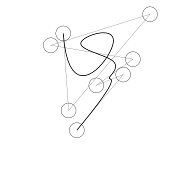

# Drawing with the Caml



Needed things
---
  * [Nix](https://nixos.org/nix/)

Quick start
---
```bash
$ nix-shell
$ sh main.sh {spline|word|sentence}
```

Otherwise
---
To [compile](https://ocaml.org/learn/tutorials/compiling_ocaml_projects.html) with required packages and modules:
```
$ ocamlfind ocamlopt -package LIBRARY1,LIBRARY2 MODULE1.ml MODULE2.ml -linkpkg MAIN.ml -o MAIN
```

---
To load these things into the REPL on the fly:
```bash
$ ocamlc -c MODULE.ml
```
```utop
utop # #use "topfind";;
utop # #require "LIBRARY";;
utop # #load "MODULE.cmo";;
utop # #use "MAIN.ml";;
```
